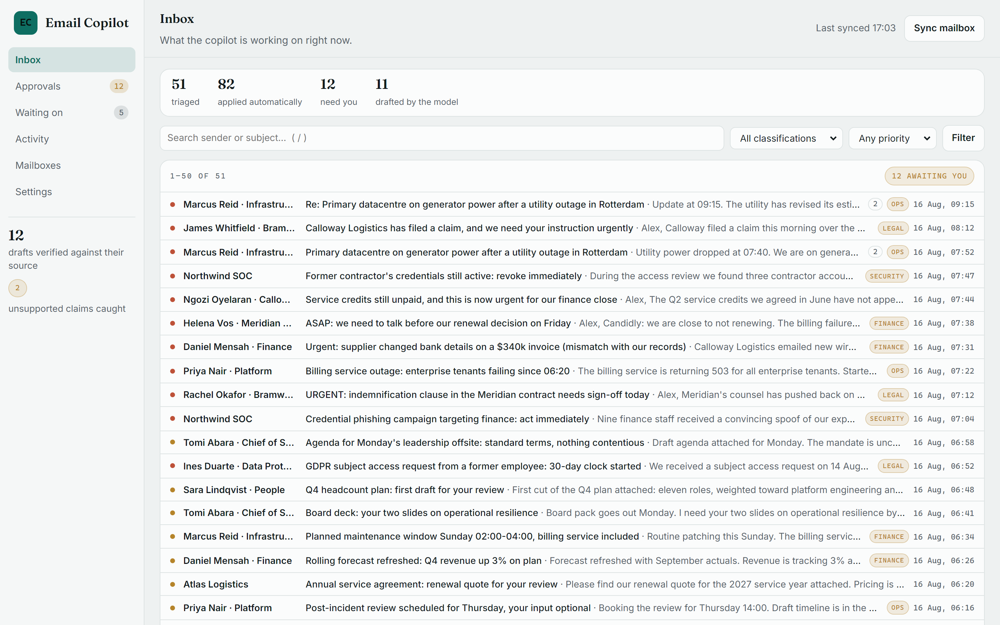
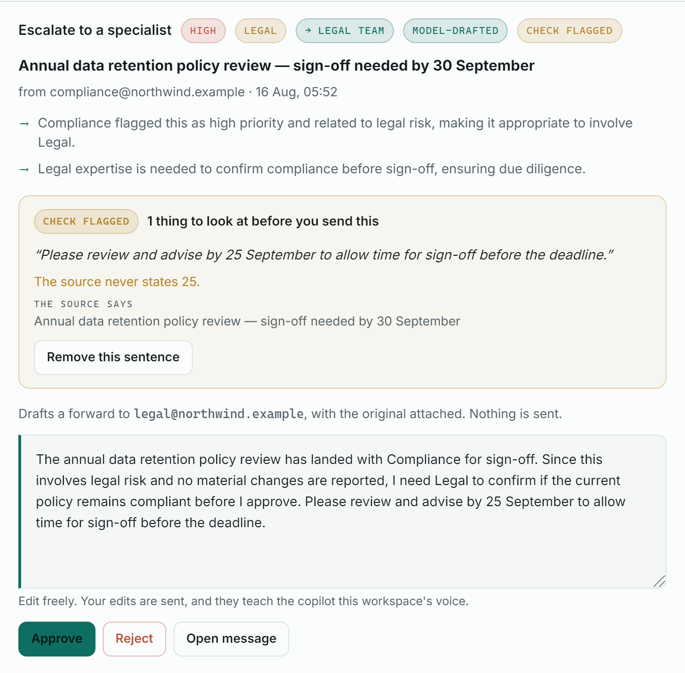

# Executive Email Copilot

[](https://github.com/rogerdemello/autonomous-executive-email-copilot/actions/workflows/ci.yml)


> **An email copilot for people whose inbox can't wait.** It reads a real mailbox,
> triages by deadline and risk, drafts the replies worth sending, routes legal and
> security matters to the right owner — and holds every outbound action for a human.

## ▶ [Try the live demo](https://exec-email-copilot.onrender.com) — one click, no sign-up

Press **Try the live demo** on the landing page and you are inside a private,
fully triaged executive inbox: 51 messages already classified, 12 replies and
escalations held for your approval, and the draft the verifier caught inventing
a deadline. Nothing is sent anywhere, and the sandbox is deleted when you sign
out. (The hosted instance can take up to a minute to wake if nobody has used it
recently.)

<p align="center">
  
  
</p>

<sub>Real screenshots of the running app, captured by
[`scripts/capture_screenshots.py`](scripts/capture_screenshots.py) — not mockups.
Right: the model wrote "advise by 25 September" for a message whose deadline is
30 September. The checker caught it and shows its evidence.</sub>

Connect Gmail or Microsoft 365 and the copilot works the inbox: it classifies each
message, infers priority, deadline, business value, and risk, then proposes an
action. Anything that touches the outside world — a reply, an escalation — waits
for your sign-off. Anything internal and low-risk applies itself as a label.

It is multi-tenant from the ground up: organizations, three ranked roles, encrypted
mailbox tokens, a per-organization audit log, data export, and hard delete.

---

## See it in 60 seconds

**Hosted:** open the [live demo](https://exec-email-copilot.onrender.com) and press
**Try the live demo**.

**Locally** — no API key, no OAuth credentials, no network, and no seeding step:

```bash
pip install -r requirements.txt
uvicorn app.main:app --port 8000
```

Open **http://localhost:8000** and press **Try the live demo**. That builds you a
private sandbox workspace on the spot (about a second) and signs you in. There is
nothing to seed and no password to find, so it works on an empty database too.

| Step | What you see |
|---|---|
| `/` → **Try the live demo** | One click into a populated inbox, with a two-minute tour on top |
| `/app/inbox` | 51 triaged messages, with the copilot's reasoning and its drafts |
| `/app/approvals` | The 12 actions waiting on a human: 10 drafts verified against their source, 2 the verifier flagged |
| `/app/waiting` | Promises found in the mail, in both directions, with dates |
| `/app/activity` | The audit trail of everything you just did |
| `/app/connect` | Gmail · Microsoft 365 · **Demo mailbox** |
| `/contact-sales` | The lead form. Self-serve is the default path; there is no pricing page |

Every visitor gets a workspace of their own, so what one person approves never
empties the queue for the next. [docs/DEMO.md](docs/DEMO.md) is a walkthrough
script, including how the sandbox is bounded and what is real versus simulated.
`make demo` still seeds a *shared* demo account with a prefilled sign-in, which
some sales calls prefer.

**The demo mailbox is content, not theatre.** Its routing is computed by the same
`BaselinePolicy` that runs against a real Gmail account, from the same inferred
signals — edit a subject line in [data/demo/inbox.json](data/demo/inbox.json) and
the decision genuinely changes. Four messages are deliberate near-misses, because
a classifier that never declines has not classified anything.

To have the model write the prose too, run the seeder once with a key:

```bash
python scripts/seed_demo.py --fresh --with-llm
```

That generates every reply and escalation note through
[`app/llm/drafter.py`](app/llm/drafter.py) and commits them to
`data/demo/drafts.json`. Later runs replay them from disk, so the demo shows real
model output with no network and no key.

## How it works

```
mailbox provider  ->  enrich  ->  policy  ->  proposals  ->  approval  ->  provider write
(Gmail/Graph/demo)    infer       decide     hold or auto     human       send/label/archive
                      signals
```

- **[`app/copilot/providers`](app/copilot/providers)** — one interface per mail
  backend. Gmail and Microsoft Graph over OAuth; a demo mailbox that needs nothing.
- **[`app/copilot/enrich.py`](app/copilot/enrich.py)** — infers sender role, risk
  tag, priority, deadline, and business value from the message itself.
- **[`app/copilot/policy.py`](app/copilot/policy.py)** — decides: classify, reply,
  escalate, or defer. Deterministic; no credentials required.
- **[`app/saas/sync_service.py`](app/saas/sync_service.py)** — persists per tenant,
  auto-applies low-risk actions, holds `reply` and `escalate` for a human.
- **[`app/llm/drafter.py`](app/llm/drafter.py)** — writes the reply, or the
  handover note for an escalation. It is handed a decision and asked only for
  words.
- **[`app/web`](app/web)** — the UI: Jinja templates and one stylesheet. No bundler.

**Where the model is, and where it deliberately isn't.** Routing is
deterministic: priority, risk, deadline and the choice between reply / escalate /
defer / file are computed by code that runs identically with no provider
configured. The model writes prose only. That split is the point — the decisions
stay reproducible and testable, and a model outage costs you wording rather than
triage. `LLM_DRAFTING_ENABLED=true` turns on live drafting for a real mailbox;
already-generated drafts always replay from disk regardless.

**Draft quality is gated, not vibes.** The routing benchmark grades decisions;
[`scripts/eval_drafts.py`](scripts/eval_drafts.py) grades the *prose*. A
deterministic rubric (every number in a draft must appear in the source
message, greetings must name someone the source mentions, length bounds, no
risky content) runs in CI on every push over the committed demo drafts, and a
nightly job adds an LLM-judged grounding/tone/actionability score when a key
is configured. Honest baseline: the corpus scores 10/11 — the rubric caught
the model inventing a "25 September" deadline for a message whose deadline is
30 September, and that flag is kept as proof the gate works.

**Draft-then-verify.** Before a reply or handover enters the approval queue,
a second pass ([`app/llm/verifier.py`](app/llm/verifier.py)) checks the prose
against the message it answers — the deterministic rubric always (free, no
network), plus a model fact-check pass when live drafting is on. The verdict
rides on the action as a "verified" or "check flagged" chip with the exact
notes, so the reviewer knows where to look first. A flagged draft still
queues: the human is the gate, verification is the flashlight. In the demo
queue this is visible immediately: ten drafts verify, and two are flagged — one
for that invented "25 September" deadline.

**Learning from the approval queue.** Every approve / amend-then-approve /
reject is a labeled example, and the copilot uses all three
([`app/saas/learning.py`](app/saas/learning.py)): a proposal shape the team
keeps rejecting (≥3 decisions, ≥80% rejected) stops being proposed and is
filed as deferred — with the reason written on the action; drafts the team
approved or corrected ride along in the drafting prompt as few-shot voice
examples; and the approvals page shows a "what the copilot has learned"
panel that names the exact decisions each behaviour came from. Reviewers can
edit any draft before approving — the edit is what gets sent, and the
(original, edited) pair is kept as the strongest style signal. All of it is
tenant-scoped and none of it touches the deterministic policy.

**Background sync.** `SYNC_WORKER_ENABLED=true` starts a background worker that
sweeps every connected mailbox on a jittered per-connection cadence
(`SYNC_WORKER_INTERVAL_SECONDS`, default 5 minutes) — the approval queue fills
while nobody is clicking "Sync now". It is off by default so tests and one-shot
scripts never grow surprise threads; the Helm chart turns it on. One broken
mailbox is backed off and logged without stalling the others. Gmail label
writes are batched (`batchModify`), so a 100-message first sync costs 2 write
calls per label instead of 200.

Inbound messages are scanned for prompt injection *before* they reach a provider,
and a message that tries to rewrite the instructions is never sent to one — it
falls back to fixture prose and still reaches a human. Generated drafts are
scanned again on the way out.

## What to look at

If you have ten minutes, these are the decisions worth reading, each with the code
and the test that pins it:

| Decision | Code | Pinned by |
|---|---|---|
| **Routing is deterministic; the model writes prose only** | [`app/copilot/policy.py`](app/copilot/policy.py), [`app/llm/drafter.py`](app/llm/drafter.py) | [`test_copilot_policy.py`](tests/test_copilot_policy.py); the drafter is tested for how it *fails* ([`test_llm_drafter.py`](tests/test_llm_drafter.py)) |
| **Every draft is checked against its source** before it queues | [`app/llm/verifier.py`](app/llm/verifier.py), [`scripts/eval_drafts.py`](scripts/eval_drafts.py) | [`test_draft_verify.py`](tests/test_draft_verify.py), [`test_draft_eval.py`](tests/test_draft_eval.py), a CI gate and a [nightly job](.github/workflows/draft-eval.yml) |
| **Inbound mail is screened for prompt injection** (pattern-based) before any model sees it | [`app/llm/safety/guardrails.py`](app/llm/safety/guardrails.py) | [`test_safety.py`](tests/test_safety.py) |
| **Nothing outbound sends without a human**; no setting turns that off | [`app/saas/sync_service.py`](app/saas/sync_service.py) | [`test_inbox_pipeline.py`](tests/test_inbox_pipeline.py) |
| **Tenant isolation and three ranked roles** | [`app/saas/repository.py`](app/saas/repository.py), [`rbac.py`](app/saas/rbac.py) | [`test_multitenant.py`](tests/test_multitenant.py), [`test_product_isolation.py`](tests/test_product_isolation.py) |
| **OIDC single sign-on**, `id_token` verified RS256 against the issuer's JWKS | [`app/saas/oidc.py`](app/saas/oidc.py) | [`test_saas_sso.py`](tests/test_saas_sso.py) |
| **Mailbox tokens encrypted at rest**, decrypted in exactly one module | [`app/saas/crypto.py`](app/saas/crypto.py) | [`test_saas_mailbox.py`](tests/test_saas_mailbox.py) |
| **Erasure that provably covers every tenant table** — a test reads the live schema and fails on any `org_id` table it misses | [`app/saas/data_lifecycle.py`](app/saas/data_lifecycle.py) | [`test_saas_data_lifecycle.py`](tests/test_saas_data_lifecycle.py) |
| **A model-spend ceiling per workspace**; at the cap, prose degrades and triage does not | [`app/saas/llm_budget.py`](app/saas/llm_budget.py) | [`test_llm_budget.py`](tests/test_llm_budget.py) |
| **A public demo that cannot be abused**: private per-visitor sandbox, rate-limited, capped, auto-deleted, no model spend | [`app/saas/sandbox.py`](app/saas/sandbox.py) | [`test_demo_sandbox.py`](tests/test_demo_sandbox.py) |
| **Providers tested against a stateful fake of Gmail's and Graph's HTTP APIs**, not a stub | [`tests/integration/`](tests/integration) | the suite itself — it found a revoked-token bug the unit tests could not |
| **Observability**: OpenTelemetry traces (`gateway.request`, `inbox.sync`, `inbox.approve`, the model call), Prometheus metrics, a one-page operator console | [`telemetry/`](telemetry), [`app/saas/operator_views.py`](app/saas/operator_views.py) | [`test_otel_spans.py`](tests/test_otel_spans.py), [`test_observability.py`](tests/test_observability.py), [`test_operator_view.py`](tests/test_operator_view.py) |
| **A benchmark with honest results**, including the ones that went against the design | [`research/`](research), [`docs/BENCHMARK.md`](docs/BENCHMARK.md) | CI re-runs the deterministic columns on every build |
| **Episode replay** that survives a restart | `GET /replay/{episode_id}` in [`app/main.py`](app/main.py) | [`test_phase0_wiring.py`](tests/test_phase0_wiring.py) |
| **Postgres and Kubernetes** | `psycopg`; [`helm/`](helm/exec-email-copilot) | a CI job runs the database suites on real Postgres; another lints and renders the chart and checks that unsafe configurations refuse to render |

## Project layout

```
app/            the product
  core/         config, database, models, security, approval
  copilot/      mail providers, signal inference, decision policy
  llm/          provider abstraction, LLM agent, prompts, safety
  saas/         accounts, RBAC, licensing, mailbox sync, audit log
  web/          server-rendered UI (templates + static)
research/       the deterministic RL-style benchmark this grew out of
  sim/          environment, graders, scenarios, agents
  baseline/ benchmark/ inference.py
data/           demo mailbox, task and scenario configs
docs/  tests/  scripts/  telemetry/  reports/  helm/
```

Dependencies point one way: `research` may import from `app`, never the reverse.

## Install and run

```bash
python -m venv .venv
.\.venv\Scripts\Activate.ps1      # Windows PowerShell
source .venv/bin/activate          # Linux/macOS

pip install -r requirements.txt
uvicorn app.main:app --reload --port 8000
```

Tests: `python -m pytest -q`. CI gate locally: `make check` (lint + tests) or `make cov`.

## Connecting a real mailbox

Set OAuth client credentials for the provider you want, then use **Connect** in the app:

```bash
OAUTH_REDIRECT_BASE_URL=https://your-host
GOOGLE_OAUTH_CLIENT_ID=...        GOOGLE_OAUTH_CLIENT_SECRET=...
MICROSOFT_OAUTH_CLIENT_ID=...     MICROSOFT_OAUTH_CLIENT_SECRET=...
```

Tokens are encrypted at rest before storage and decrypted in exactly one module
([`app/saas/provider_factory.py`](app/saas/provider_factory.py)). A provider with no
credentials configured shows as unavailable in the UI rather than failing when
clicked — the demo mailbox always works.

## Documentation

- [docs/DEMO.md](docs/DEMO.md) — the demo walkthrough script.
- [docs/ARCHITECTURE.md](docs/ARCHITECTURE.md) — layers, request flow, design decisions.
- [docs/COMMERCIAL.md](docs/COMMERCIAL.md) — accounts, organizations, RBAC, licensing.
- [docs/TECHNICAL_REFERENCE.md](docs/TECHNICAL_REFERENCE.md) — full, code-derived reference.
- [docs/RUNBOOK.md](docs/RUNBOOK.md) — operations: probes, metrics, alerts, incidents.
- [docs/THREAT_MODEL.md](docs/THREAT_MODEL.md) — STRIDE-per-boundary model and honest limits.
- [docs/BENCHMARK.md](docs/BENCHMARK.md) · [docs/WHITEPAPER.md](docs/WHITEPAPER.md) — the research side.
- [CONTRIBUTING.md](CONTRIBUTING.md) · [SECURITY.md](SECURITY.md) · [.env.example](.env.example)

---

# The benchmark underneath

The product grew out of a reproducible benchmark for executive-inbox agents, kept
intact under [`research/`](research). It is a Gym-style reset/step/state environment
with bounded, numerically stable graders and a deterministic scenario generator —
which is how the routing policy above was chosen rather than guessed.

Mean task score (open interval `(0,1)`, higher is better) over **3 personas × 3 seeds**
per cell. The LLM column is real Azure OpenAI `gpt-4o`.

| Task | Baseline (heuristic) | Multi-agent (task-aware) | LLM — Azure `gpt-4o` |
|------|:---:|:---:|:---:|
| `easy_classification` | **1.00** | 0.80 | 0.17 |
| `medium_prioritization` | **1.00** | **1.00** | **1.00** |
| `hard_full_management` | **0.67** | 0.09 | 0.62 |

<sub>Deterministic agents have ≈0 variance; the LLM ran at `temperature=0.2` and
averaged ~3k tokens / **≈ $0.009 per episode**. Scores are persona-invariant by
design — see [docs/BENCHMARK.md](docs/BENCHMARK.md).</sub>

**Honest findings, not tuned:**

- The benchmark **discriminates** — a strong heuristic, a naive multi-agent crew, and a
  frontier LLM separate clearly, and differently per task.
- On realistic **full management** the LLM (`0.62`) is competitive with the hand-tuned
  baseline (`0.67`) and far ahead of the naive multi-agent (`0.09`).
- On narrow **classification** the LLM scores low (`0.17`): its task-blind guardrails
  trade coverage for caution. That is an agent-design finding, not a model-capability one.

Reproduce (deterministic agents need no API key):

```bash
# --seeds pinned to the published table's grid (the CLI default is 8 seeds)
python scripts/run_benchmark.py --agents baseline multiagent --seeds 42 43 44 --out artifacts/results
```

Supported tasks: `easy_classification`, `medium_prioritization`, `hard_full_management`.
Config lives in [data/tasks.yaml](data/tasks.yaml), [data/settings.yaml](data/settings.yaml),
and [data/scenarios/](data/scenarios/).

## API Surface With Examples

Base URL: `http://localhost:8000`

### 1) Core Runtime

Endpoints:

- `GET /`
- `GET /favicon.ico`
- `GET /health`
- `GET /health/live` (liveness probe)
- `GET /health/ready` (readiness probe — checks DB)
- `GET /version`
- `GET /tasks`
- `POST /reset`
- `POST /step`
- `GET /state`
- `POST /state`

Request:

```bash
curl -s -X POST http://localhost:8000/reset \
  -H "Content-Type: application/json" \
  -d '{"task_id":"easy_classification","seed":42,"persona":"balanced"}'
```

Response (trimmed):

```json
{
  "emails": [
    {
      "id": "msg_001",
      "sender": "client@example.com",
      "priority_hint": "high",
      "risk_tag": "none"
    }
  ],
  "time_remaining": 60,
  "pending_actions": ["classify", "reply", "defer", "escalate", "prioritize"],
  "risk_level": "medium",
  "current_minute": 0,
  "persona": "balanced",
  "remaining_interruptions": 1
}
```

Step action:

```bash
curl -s -X POST http://localhost:8000/step \
  -H "Content-Type: application/json" \
  -d '{"action_type":"classify","email_id":"msg_001","label":"urgent"}'
```

### 2) Scoring And Policy Execution

Endpoints:

- `POST /grader`
- `POST /baseline`
- `POST /leaderboard`
- `GET /replay/{episode_id}`

Baseline run:

```bash
curl -s -X POST http://localhost:8000/baseline \
  -H "Content-Type: application/json" \
  -d '{"task_id":"hard_full_management","seed":42,"persona":"balanced","mode":"baseline","max_steps":100}'
```

Response (trimmed):

```json
{
  "task_id": "hard_full_management",
  "seed": 42,
  "persona": "balanced",
  "mode": "baseline",
  "stress_rate": 0.0,
  "score": 0.732,
  "total_reward": 5.4,
  "steps": 11,
  "breakdown": {
    "classification_accuracy": 0.8,
    "sla": 0.7
  },
  "action_trace": [],
  "decision_trace": []
}
```

Trajectory grading:

```bash
curl -s -X POST http://localhost:8000/grader \
  -H "Content-Type: application/json" \
  -d '{
    "task_id":"easy_classification",
    "seed":42,
    "persona":"balanced",
    "actions":[{"action_type":"classify","email_id":"msg_001","label":"normal"}]
  }'
```

### 3) Approval Workflow

Endpoints:

- `POST /approval/request`
- `POST /approval/{request_id}/approve`
- `POST /approval/{request_id}/reject`
- `GET /approval/{request_id}`
- `GET /approval/pending`
- `GET /approval/history`

Create request:

```bash
curl -s -X POST http://localhost:8000/approval/request \
  -H "Content-Type: application/json" \
  -d '{"action_type":"escalate","email_id":"msg_002","escalate_to":"legal-team"}'
```

Approve request:

```bash
curl -s -X POST http://localhost:8000/approval/REQUEST_ID/approve \
  -H "Content-Type: application/json" \
  -d '{"approver_id":"ops_lead","comment":"Approved for compliance"}'
```

### 4) Episode And Preference Repositories

Endpoints:

- `GET /episodes`
- `GET /episodes/{episode_id}`
- `GET /episodes/stats`
- `GET /preferences/user/{user_id}`
- `PUT /preferences/user/{user_id}`
- `GET /preferences/users`
- `GET /preferences/team/{team_id}`
- `PUT /preferences/team/{team_id}`
- `GET /preferences/teams`

List episodes:

```bash
curl -s "http://localhost:8000/episodes?page=1&limit=2"
```

Response (trimmed):

```json
{
  "episodes": [
    {
      "episode_id": "hard_full_management_42_balanced",
      "task_id": "hard_full_management",
      "score": 0.732
    }
  ],
  "total": 1,
  "page": 1,
  "limit": 2,
  "total_pages": 1
}
```

Save user preference:

```bash
curl -s -X PUT http://localhost:8000/preferences/user/alex \
  -H "Content-Type: application/json" \
  -d '{"default_persona":"strict_ceo","notification_email":"alex@company.com"}'
```

### 5) Learning And Feedback

Endpoints:

- `POST /feedback`
- `GET /feedback`
- `GET /learning/stats`
- `GET /learning/examples/{task_id}/{persona}`

Submit feedback:

```bash
curl -s -X POST http://localhost:8000/feedback \
  -H "Content-Type: application/json" \
  -d '{
    "episode_id":"hard_full_management_42_balanced",
    "task_id":"hard_full_management",
    "seed":42,
    "persona":"balanced",
    "step_index":3,
    "action_type":"reply",
    "email_id":"msg_004",
    "feedback":"good",
    "comment":"Clear and concise response"
  }'
```

Fetch examples:

```bash
curl -s http://localhost:8000/learning/examples/hard_full_management/balanced
```

### 6) Benchmark And Reports

Endpoints:

- `POST /benchmark/run`
- `POST /benchmark/run_html`
- `GET /reports/episode/{episode_id}`
- `POST /reports/generate`

Run benchmark:

```bash
curl -s -X POST http://localhost:8000/benchmark/run \
  -H "Content-Type: application/json" \
  -d '{"tasks":["easy_classification"],"personas":["balanced"],"seeds":[42],"max_steps":50}'
```

Download PDF report:

```bash
curl -L -o report.pdf http://localhost:8000/reports/episode/hard_full_management_42_balanced
```

### 7) Telemetry And Alerting

Endpoints:

- `GET /metrics`
- `POST /alerts/webhook`
- `GET /alerts`

Attach webhook rule:

```bash
curl -s -X POST http://localhost:8000/alerts/webhook \
  -H "Content-Type: application/json" \
  -d '{"url":"https://example.com/webhook","rule_name":"high_failure_rate"}'
```

Response:

```json
{
  "status": "ok",
  "message": "Webhook added to rule high_failure_rate"
}
```

Read metrics:

```bash
curl -s http://localhost:8000/metrics
```

### 8) Simulator live-state API

A WebSocket + REST view of the running simulator (the React dashboard that
once consumed it was removed; the API remains for external tooling):

Endpoints:

- `WS /ws/dashboard`
- `GET /dashboard/health`
- `GET /dashboard/state`
- `POST /dashboard/state`
- `POST /dashboard/reset`

Dashboard reset call:

```bash
curl -s -X POST "http://localhost:8000/dashboard/reset?task_id=hard_full_management&seed=42&persona=balanced"
```

WebSocket ping frame:

```json
{"type":"ping"}
```

WebSocket pong frame:

```json
{"type":"pong"}
```

### Auto-Generated Docs

- `GET /docs`

## Modes

- `baseline`: deterministic heuristic agent.
- `stress`: heuristic with randomized perturbation by `stress_rate`.
- `llm`: LLM-driven strategy and action synthesis with safety/approval gates.
- `hybrid`: LLM planner + heuristic executor; accepted by both the CLI runner and the `/baseline` API.

## UI

Server-rendered from [app/web](app/web): Jinja templates plus one stylesheet, with
no bundler and no build step. Pages: landing, the live demo, login, signup, contact
sales, privacy, terms, connect a mailbox, inbox, approvals, waiting on, activity,
settings. Every action works as a plain form POST, so the app functions with
JavaScript disabled. Static assets are fingerprinted (`?v=<digest>`) so a returning
visitor never pairs new markup with an old stylesheet, and every page is checked
for accessibility and for sideways scroll at 320px in both themes.

## Deployment Notes

- Application entrypoint: [app/main.py](app/main.py) — exports `app` and a `main()` runner
- Container build: [Dockerfile](Dockerfile)
- Render Blueprint: [render.yaml](render.yaml)
- CI workflow: [.github/workflows/ci.yml](.github/workflows/ci.yml)
- Deployment guide: [DEPLOYMENT_GUIDE.md](DEPLOYMENT_GUIDE.md)

Run the container (single stage — no Node toolchain):

```bash
docker build -t exec-email-copilot .
docker run -p 8000:8000 exec-email-copilot
# or
docker compose up --build
```

**Deploy on Render:** push to GitHub, then **New → Blueprint** and point Render
at this repo — [`render.yaml`](render.yaml) provisions a single Docker web
service. The container binds the `$PORT` Render injects (8000 locally). See
[DEPLOYMENT_GUIDE.md](DEPLOYMENT_GUIDE.md) for secrets and durable-storage notes.

## Security & Configuration

All configuration is environment-driven (see [.env.example](.env.example), loaded
via `app/core/config.py`). Security controls are **opt-in** so local dev, tests, and
automated tooling work with zero setup:

- `API_AUTH_TOKEN` — when set, mutating routes **and reads of the benchmark
  surface** (`/approval`, `/episodes`, `/preferences`, `/dashboard`, …) require
  `Authorization: Bearer <token>` or `X-API-Key`. The product API and web UI
  authenticate per-user and are unaffected.
- `CORS_ORIGINS` — comma-separated allowed origins (default `*`).
- `RATE_LIMIT_PER_MINUTE` — per-IP request cap (default `0` = disabled).
- `REQUIRE_APPROVAL` — **benchmark simulator only**: routes the sim agent's
  `reply`/`escalate` through the in-memory approval store (default off). The
  *product's* approval gate is not a setting — outbound actions from a real
  mailbox are always held for a human (`app/copilot/pipeline.py`).
- `LOG_LEVEL` — structured logs; every response carries an `X-Request-ID`.
- `ENVIRONMENT=production` — refuses to start without `AUTH_SECRET_KEY`, rather than
  silently signing sessions and licenses with the well-known development secret.
- `OIDC_ISSUER` / `OIDC_CLIENT_ID` / `OIDC_CLIENT_SECRET` — enables SSO sign-in;
  id_tokens are verified RS256 against the issuer's published JWKS.

The web session is an HttpOnly, `SameSite=Lax` cookie carrying the same token the API
accepts as a Bearer header, and every mutating form is guarded by a signed CSRF token
bound to that session.

Observability: Prometheus metrics at `/metrics`, alert evaluation at `/alerts`,
provisioning under [telemetry/](telemetry/), and an ops [runbook](docs/RUNBOOK.md).

## Testing Coverage

**1,362 tests pass at 85% coverage** (measured 2026-10-04; CI's gate is 78%, and the full run takes about fifteen minutes). Tests under [tests/](tests/) cover the web UI end to end (session gate, CSRF, the demo mailbox, the per-visitor demo sandbox, approvals), API contracts, determinism, grading bounds, the copilot's routing rules, schema migrations, LLM tool-call parsing, benchmark and report generation, and telemetry — plus a Hypothesis-driven property/invariant harness ([tests/harness/](tests/harness/)). Run the full CI gate locally with `make cov`.

The drafter is tested for how it *fails* rather than how it writes ([tests/test_llm_drafter.py](tests/test_llm_drafter.py)): a missing key, a dead provider, a non-JSON answer, an injected message and a risky generation must each degrade to the fallback prose without raising, because all of them happen inside a request that is syncing someone's mailbox.

Accessibility is swept, not sampled ([tests/test_web_a11y.py](tests/test_web_a11y.py)): every public, signed-in and operator page is rendered and checked for one `<h1>`, a `<main>` landmark, an accessible name on every control, no positive `tabindex`, `alt` on every image, and captions with scoped headers on every table. The stdlib HTML parser does the work — an accessibility gate that needs a new dependency is a gate someone eventually deletes. [tests/test_web_reflow.py](tests/test_web_reflow.py) drives a real browser to assert no page scrolls sideways at 320px in either theme (WCAG 1.4.10); it needs Playwright and skips without it.

## Important Constraints

- `/baseline` mode enum is `baseline | stress | llm | hybrid`.
- `/baseline` runs are persisted to the episode DB and (when they clear the score threshold) auto-saved to the learning trajectory store; `/replay/{episode_id}` falls back to the DB so replay survives a restart.
- LLM mode behavior depends on provider credentials and guardrail checks. The human-in-the-loop approval gate is opt-in (`LLMAgent(require_approval=True)` or the `REQUIRE_APPROVAL` env var); with it off the agent returns its decided action directly.
- LLM responses are cached by observation hash (TTL + size cap); the cache is bypassed when approval is required.