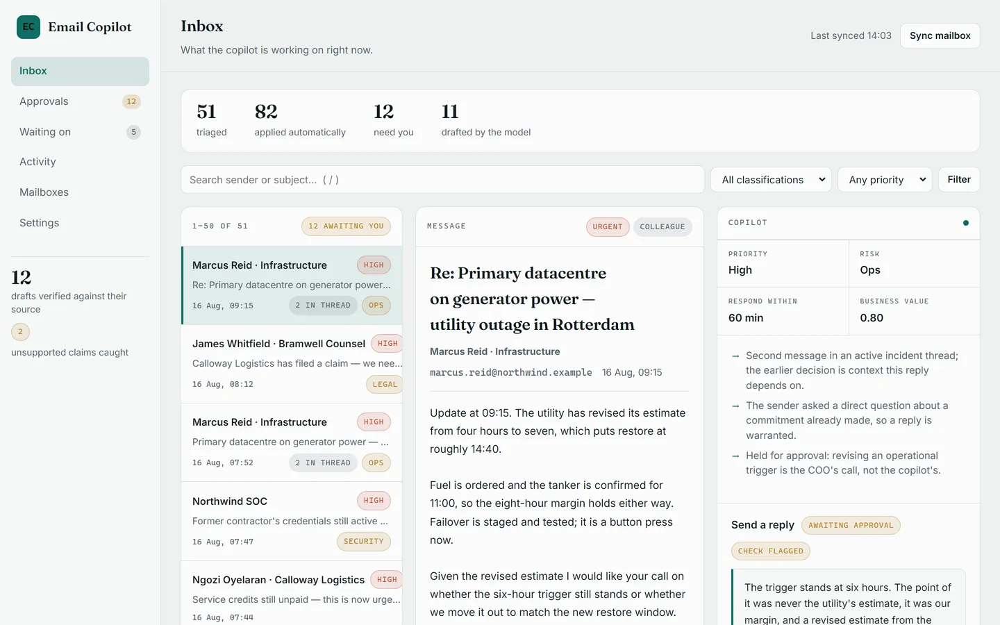

# Executive Email Copilot

[](https://github.com/rogerdemello/autonomous-executive-email-copilot/actions/workflows/ci.yml)


> **An email copilot for people whose inbox can't wait.** It reads a real mailbox,
> triages by deadline and risk, drafts the replies worth sending, routes legal and
> security matters to the right owner, and holds every outbound action for a human.

## ▶ [Try the live demo](https://exec-email-copilot.onrender.com): one click, no sign-up

Press **Try the live demo** on the landing page and you are inside a private, fully
triaged executive inbox: 51 messages already classified, 12 replies and escalations
held for your approval, and the draft the verifier caught inventing a deadline.
Nothing is sent anywhere, and the sandbox is deleted when you sign out. (The hosted
instance can take up to a minute to wake if nobody has used it recently.)

<p align="center">
  
  
</p>

<sub>Real screenshots of the running app, captured by
[`scripts/capture_screenshots.py`](scripts/capture_screenshots.py), not mockups.
Right: the model wrote "advise by 25 September" for a message whose deadline is
30 September. The checker caught it and shows its evidence.</sub>

**Built with:** Python 3.10+ · FastAPI · server-rendered Jinja (no JavaScript build) ·
SQLAlchemy on SQLite or Postgres · the OpenAI SDK (OpenAI-compatible endpoints, and
Azure OpenAI) · OpenTelemetry and Prometheus · Docker, Helm and a Render blueprint.

---

## Four decisions that define it

1. **Code decides; the model only writes.** Priority, risk, deadline and the choice
   between reply, escalate, defer and file are computed by deterministic code that
   behaves identically with no model configured. The model is handed that decision
   and asked for words. A model outage costs wording, not triage. The policy
   was *selected by a benchmark* ([below](#the-benchmark-underneath)), not guessed.
2. **Nothing outbound without a human.** Replies and escalations queue for approval,
   and no setting turns that off. Internal, low-risk actions apply themselves as
   labels, because the worst they can do is mislabel a message.
3. **Every draft is checked against its source.** A second pass reads the prose back
   against the message it answers and flags any number, date or name the source
   never gave. A flagged draft still queues: the human is the gate, the checker is
   the flashlight.
4. **Claims are tests.** Erasure provably covers every tenant table (a test reads the
   live schema and fails on any it misses). The demo cannot spend the deployment's
   model budget. The landing page cannot claim a feature the code does not have.
   When something shipped broken, the fix came with the test that would have caught it.

## Try it

**Hosted:** open the [live demo](https://exec-email-copilot.onrender.com) and press
**Try the live demo**.

**Locally** (no API key, no OAuth credentials, no network, no seeding step):

```bash
pip install -r requirements.txt
uvicorn app.main:app --port 8000
```

Open **http://localhost:8000** and press **Try the live demo**. It builds you a private
sandbox workspace on the spot (about a second) and signs you in, so it works on an
empty database too.

| Step | What you see |
|---|---|
| `/` → **Try the live demo** | One click into a populated inbox, with a two-minute tour on top |
| `/app/inbox` | 51 triaged messages, with the copilot's reasoning and its drafts |
| `/app/approvals` | The 12 actions waiting on a human: 10 drafts verified against their source, 2 the verifier flagged |
| `/app/waiting` | Promises found in the mail, in both directions, with dates |
| `/app/activity` | The audit trail of everything you just did |

Every visitor gets a workspace of their own, so what one person approves never empties
the queue for the next. [docs/DEMO.md](docs/DEMO.md) is a walkthrough script that also
says exactly what is real and what is simulated.

**The demo mailbox is content, not theatre.** Its routing is computed by the same
`BaselinePolicy` that would run against a real Gmail account, from the same inferred
signals: edit a subject line in [`data/demo/inbox.json`](data/demo/inbox.json) and the
decision genuinely changes. Four messages are deliberate near-misses, because a
classifier that never declines has not classified anything.

## How it works

```
mailbox provider  ->  enrich  ->  policy  ->  proposals  ->  approval  ->  provider write
(Gmail/Graph/demo)    infer       decide     hold or auto     human       send/label/archive
                      signals
```

- **[`app/copilot/providers`](app/copilot/providers)**: one interface per mail
  backend: Gmail and Microsoft Graph over OAuth, and a demo mailbox that needs nothing.
- **[`app/copilot/enrich.py`](app/copilot/enrich.py)**: infers sender role, risk tag,
  priority, deadline and business value from the message itself.
- **[`app/copilot/policy.py`](app/copilot/policy.py)**: decides: classify, reply,
  escalate or defer. Deterministic; no credentials required.
- **[`app/saas/sync_service.py`](app/saas/sync_service.py)**: persists per tenant,
  auto-applies low-risk actions, holds `reply` and `escalate` for a human.
- **[`app/llm/drafter.py`](app/llm/drafter.py)**: writes the reply, or the handover
  note for an escalation. It is given one message, the inferred signals, and up to
  three of the workspace's own approved replies as a guide to voice.
- **[`app/llm/verifier.py`](app/llm/verifier.py)**: checks each draft against its source.
- **[`app/web`](app/web)**: the UI: Jinja templates and one stylesheet. No bundler;
  every action works as a plain form POST, so it functions with JavaScript disabled.

**Draft quality is gated.** The routing benchmark grades decisions;
[`scripts/eval_drafts.py`](scripts/eval_drafts.py) grades the *prose*. A deterministic
rubric (every number in a draft must appear in the source, greetings must name someone
the source mentions, length bounds, no risky content) runs in CI over the committed
demo drafts, and a nightly job adds an LLM-judged score when a key is configured. The
corpus scores 10/11, honestly: the rubric catches the model inventing a "25 September"
deadline for a message whose deadline is 30 September, and that flag is kept as proof
the gate works. In the product the verifier checks every held draft: the deterministic
rubric always, plus a model fact-check when live drafting is on. The verdict rides
on the action as a "verified" or "check flagged" chip with the exact evidence.

**It learns from the approval queue.** Every approve, amend-then-approve and reject is a
labelled example ([`app/saas/learning.py`](app/saas/learning.py)). A proposal shape the
team keeps rejecting (at least 3 decisions, at least 80% rejected) stops being proposed
and is filed as deferred, with the reason written on the action. Approved and corrected
drafts ride along in the drafting prompt as voice examples. All of it is tenant-scoped,
and none of it touches the deterministic policy.

**It works while you are away.** `SYNC_WORKER_ENABLED=true` starts a background worker
that sweeps every connected mailbox on a jittered per-connection cadence, so the queue
fills while nobody is clicking "Sync now". One broken mailbox is backed off without
stalling the others, a revoked token raises a banner and one email to the admins, and
Gmail label writes are batched so a 100-message first sync costs two write calls per
label instead of 200.

**It fails safely.** Inbound mail is scanned for prompt injection (pattern-based)
*before* it reaches a model; a message that tries to rewrite the instructions is never
sent to one, and still reaches a human. A per-workspace monthly spend ceiling degrades
prose to a deterministic fallback while triage, verification and sending carry on.

## What to look at

If you have ten minutes, these are the decisions worth reading, each with the code and
the test that pins it:

| Decision | Code | Pinned by |
|---|---|---|
| **Routing is deterministic; the model writes prose only** | [`app/copilot/policy.py`](app/copilot/policy.py), [`app/llm/drafter.py`](app/llm/drafter.py) | [`test_copilot_policy.py`](tests/test_copilot_policy.py); the drafter is tested for how it *fails* ([`test_llm_drafter.py`](tests/test_llm_drafter.py)) |
| **Every draft is checked against its source** before it queues | [`app/llm/verifier.py`](app/llm/verifier.py), [`scripts/eval_drafts.py`](scripts/eval_drafts.py) | [`test_draft_verify.py`](tests/test_draft_verify.py), [`test_draft_eval.py`](tests/test_draft_eval.py), a CI gate and a [nightly job](.github/workflows/draft-eval.yml) |
| **Inbound mail is screened for prompt injection** (pattern-based) before any model sees it | [`app/llm/safety/guardrails.py`](app/llm/safety/guardrails.py) | [`test_safety.py`](tests/test_safety.py) |
| **Nothing outbound sends without a human**; no setting turns that off | [`app/saas/sync_service.py`](app/saas/sync_service.py) | [`test_inbox_pipeline.py`](tests/test_inbox_pipeline.py) |
| **Tenant isolation and three ranked roles** | [`app/saas/repository.py`](app/saas/repository.py), [`rbac.py`](app/saas/rbac.py) | [`test_multitenant.py`](tests/test_multitenant.py), [`test_product_isolation.py`](tests/test_product_isolation.py) |
| **OIDC single sign-on**, `id_token` verified RS256 against the issuer's JWKS | [`app/saas/oidc.py`](app/saas/oidc.py) | [`test_saas_sso.py`](tests/test_saas_sso.py) |
| **Mailbox tokens encrypted at rest**, decrypted in exactly one module | [`app/saas/crypto.py`](app/saas/crypto.py) | [`test_saas_mailbox.py`](tests/test_saas_mailbox.py) |
| **Erasure that provably covers every tenant table**: a test reads the live schema and fails on any `org_id` table it misses | [`app/saas/data_lifecycle.py`](app/saas/data_lifecycle.py) | [`test_saas_data_lifecycle.py`](tests/test_saas_data_lifecycle.py) |
| **A model-spend ceiling per workspace**; at the cap, prose degrades and triage does not | [`app/saas/llm_budget.py`](app/saas/llm_budget.py) | [`test_llm_budget.py`](tests/test_llm_budget.py) |
| **A public demo that cannot be abused**: private per-visitor sandbox, rate-limited, capped, auto-deleted, no model spend | [`app/saas/sandbox.py`](app/saas/sandbox.py) | [`test_demo_sandbox.py`](tests/test_demo_sandbox.py) |
| **Providers tested against a stateful fake of Gmail's and Graph's HTTP APIs**, not a stub | [`tests/integration/`](tests/integration) | the suite itself, which found a revoked-token bug the unit tests could not |
| **Observability**: OpenTelemetry traces (`gateway.request`, `inbox.sync`, `inbox.approve`, the model call), Prometheus metrics, a one-page operator console | [`telemetry/`](telemetry), [`app/saas/operator_views.py`](app/saas/operator_views.py) | [`test_otel_spans.py`](tests/test_otel_spans.py), [`test_observability.py`](tests/test_observability.py), [`test_operator_view.py`](tests/test_operator_view.py) |
| **A benchmark with honest results**, including the ones that went against the design | [`research/`](research), [`docs/BENCHMARK.md`](docs/BENCHMARK.md) | CI re-runs the deterministic columns on every build |
| **Episode replay** that survives a restart | `GET /replay/{episode_id}` in [`app/main.py`](app/main.py) | [`test_phase0_wiring.py`](tests/test_phase0_wiring.py) |
| **Postgres and Kubernetes** | `psycopg`; [`helm/`](helm/exec-email-copilot) | a CI job runs the database suites on real Postgres; another lints and renders the chart and checks that unsafe configurations refuse to render |

## Where it stands

Said plainly, so nobody has to find out:

- **The demo mailbox is a fixture** (51 messages, not a live inbox), and approving a
  reply in it records the send rather than transmitting it.
- **Gmail and Microsoft 365 are built and tested against stateful fakes of both APIs,
  but not yet run against a customer's real mailbox.** That needs OAuth credentials,
  and Google's verification for Gmail's restricted scopes takes weeks
  ([docs/OAUTH_SETUP.md](docs/OAUTH_SETUP.md)).
- **The hosted demo runs on a free-tier host that sleeps**, so the first load can take
  a minute. [DEPLOYMENT_GUIDE.md](DEPLOYMENT_GUIDE.md) says what a paid deployment
  looks like; `render.yaml` provisions one.
- **The model-written prose in the demo is cached model output**, generated once and
  replayed from [`data/demo/drafts.json`](data/demo/drafts.json) so the demo needs no
  key and no network. Regenerate it with `python scripts/seed_demo.py --fresh --with-llm`.
- **The benchmark's LLM column is a recorded run** (Azure `gpt-4o`, 2026-06-14), not
  something CI reproduces; the deterministic columns are re-run on every build.

# The benchmark underneath

The product grew out of a reproducible benchmark for executive-inbox agents, kept intact
under [`research/`](research). It is a Gym-style reset/step/state environment with
bounded, numerically stable graders and a deterministic scenario generator, which is how
the routing policy above was chosen rather than guessed.

Mean task score (open interval `(0,1)`, higher is better) over **3 personas × 3 seeds**
per cell. The LLM column is real Azure OpenAI `gpt-4o`.

| Task | Baseline (heuristic) | Multi-agent (task-aware) | LLM (Azure `gpt-4o`) |
|------|:---:|:---:|:---:|
| `easy_classification` | **1.00** | 0.80 | 0.17 |
| `medium_prioritization` | **1.00** | **1.00** | **1.00** |
| `hard_full_management` | **0.67** | 0.09 | 0.62 |

<sub>Deterministic agents have ≈0 variance; the LLM ran at `temperature=0.2` and averaged
~3k tokens / **≈ $0.009 per episode**. Scores are persona-invariant by design; see
[docs/BENCHMARK.md](docs/BENCHMARK.md).</sub>

**Honest findings, not tuned:**

- The benchmark **discriminates**: a strong heuristic, a naive multi-agent crew and a
  frontier LLM separate clearly, and differently per task.
- On realistic **full management** the LLM (`0.62`) is competitive with the hand-tuned
  baseline (`0.67`) and far ahead of the naive multi-agent (`0.09`).
- On narrow **classification** the LLM scores low (`0.17`): its task-blind guardrails
  trade coverage for caution. That is an agent-design finding, not a model-capability one.

Reproduce (the deterministic agents need no API key):

```bash
# --seeds pinned to the published table's grid (the CLI default is 8 seeds)
python scripts/run_benchmark.py --agents baseline multiagent --seeds 42 43 44 --out artifacts/results
```

The simulator's HTTP surface (`/reset`, `/step`, `/state`, `/baseline`, `/replay/{id}`,
…) is documented, with examples, in [docs/API.md](docs/API.md).

## Run it yourself

```bash
python -m venv .venv
.\.venv\Scripts\Activate.ps1      # Windows PowerShell
source .venv/bin/activate          # Linux/macOS

pip install -r requirements.txt
uvicorn app.main:app --reload --port 8000
```

```bash
docker build -t exec-email-copilot .
docker run -p 8000:8000 exec-email-copilot       # or: docker compose up --build
```

- **Deploy:** the [`render.yaml`](render.yaml) blueprint provisions a Docker web service
  and a managed Postgres; there is a [Helm chart](helm/exec-email-copilot) for
  Kubernetes. [DEPLOYMENT_GUIDE.md](DEPLOYMENT_GUIDE.md) covers secrets, durable storage
  and what to set; [LAUNCH_CHECKLIST.md](LAUNCH_CHECKLIST.md) is the short list of things
  only a person can do.
- **Connect a real mailbox:** set `OAUTH_REDIRECT_BASE_URL` and the Google and/or
  Microsoft client id and secret, then use **Connect** in the app. A provider with no
  credentials shows as unavailable rather than failing when clicked.
- **Configuration** is environment-driven ([`.env.example`](.env.example), read through
  [`app/core/config.py`](app/core/config.py)). Security controls are opt-in so local
  development works with zero setup; `ENVIRONMENT=production` refuses to start without a
  real `AUTH_SECRET_KEY`. [docs/API.md](docs/API.md#security--configuration) lists the
  switches.

## Quality gates

**1,365 tests, about 85% coverage** (CI's gate is 78%; the suite runs in 15–25 minutes).
They cover the web UI end to end, the per-visitor demo sandbox, API contracts,
determinism and grading bounds, schema migrations, the copilot's routing rules, and a
Hypothesis-driven property harness ([`tests/harness/`](tests/harness)).

- **Lint, types, SAST:** ruff (lint and format), mypy as a real gate, bandit, pip-audit.
- **Three Pythons and a real database:** the suite runs on 3.10, 3.11 and 3.12, and the
  database suites run again against Postgres.
- **Containers and Kubernetes:** the Docker image is built and smoke-tested, and the Helm
  chart is linted, rendered, and must refuse unsafe configurations.
- **Security scanning:** CodeQL, gitleaks over full history, and Trivy on the image.
- **Accessibility, swept not sampled:** every public, signed-in, demo and operator page is
  checked for one `<h1>`, a `<main>` landmark, accessible names and table captions
  ([`test_web_a11y.py`](tests/test_web_a11y.py)), and a real browser asserts that no page
  scrolls sideways at 320px
  ([`test_web_reflow.py`](tests/test_web_reflow.py); needs Playwright, skipped without it).
- **Claims:** the landing page's benchmark numbers are rendered from an artifact CI
  re-verifies, and a test names the phrases the public pages may not use until the
  feature exists.

Run the CI gate locally with `make check` (lint and tests) or `make cov`.

## Project layout

```
app/            the product
  core/         config, database, models, security, approval
  copilot/      mail providers, signal inference, decision policy
  llm/          provider abstraction, LLM agent, prompts, safety
  saas/         accounts, RBAC, licensing, mailbox sync, audit log, the demo sandbox
  web/          server-rendered UI (templates + static)
research/       the deterministic RL-style benchmark this grew out of
  sim/          environment, graders, scenarios, agents
  baseline/ benchmark/ inference.py
data/           demo mailbox, task and scenario configs
docs/  tests/  scripts/  telemetry/  reports/  helm/
```

Dependencies point one way: `research` may import from `app`, never the reverse.

## Documentation

- [docs/DEMO.md](docs/DEMO.md): the demo walkthrough script, and what is real versus simulated.
- [docs/ARCHITECTURE.md](docs/ARCHITECTURE.md): layers, request flow, design decisions.
- [docs/API.md](docs/API.md): the simulator's HTTP surface, runtime modes, security and configuration.
- [docs/COMMERCIAL.md](docs/COMMERCIAL.md): accounts, organizations, RBAC, licensing.
- [docs/TECHNICAL_REFERENCE.md](docs/TECHNICAL_REFERENCE.md): full, code-derived reference.
- [docs/RUNBOOK.md](docs/RUNBOOK.md): operations: probes, metrics, alerts, incidents.
- [docs/THREAT_MODEL.md](docs/THREAT_MODEL.md): STRIDE per trust boundary, and its honest limits.
- [docs/BENCHMARK.md](docs/BENCHMARK.md) · [docs/WHITEPAPER.md](docs/WHITEPAPER.md): the research side.
- [CHANGELOG.md](CHANGELOG.md) · [CONTRIBUTING.md](CONTRIBUTING.md) · [SECURITY.md](SECURITY.md)

Licensed under the [MIT License](LICENSE).
